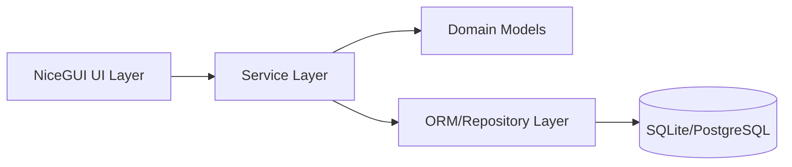
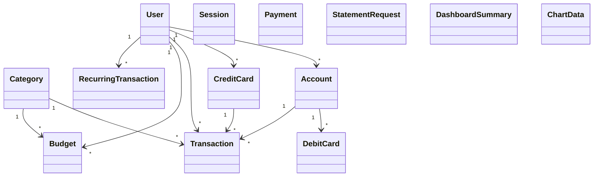

## 1. Requirements Elicitation & Clarification

### Funktionale Anforderungen
- Login mit Vertragsnummer und Passwort.
- Manuelle Erfassung, Bearbeitung, Loeschung und Filterung von Transaktionen.
- Dashboard mit Bilanz, Einnahmen, Ausgaben und Diagrammdaten.
- Monatliche Budgets (global oder pro Kategorie) inklusive Ueberschreitungswarnung.
- Wiederkehrende Zahlungen (monatlich/jaehrlich), Ausfuehrung bei Login.
- Kontoverwaltung: Privat- und Sparkonto eroeffnen/schliessen.
- Debitkartenverwaltung: bestellen, sperren, ersetzen.
- Unabhaengige Kreditkartenverwaltung mit Kreditrahmen.
- Inlandzahlungen per IBAN.
- Umbuchungen zwischen eigenen Konten.
- Kontoauszugsgenerierung als PDF.

### Nicht-funktionale Anforderungen
- Layered/MVC-nahe Struktur (UI, Services, Models).
- ORM-basierte Persistenz (z. B. SQLModel/SQLAlchemy).
- Klare Validierung aller Nutzereingaben.
- Sicherheitsregeln: Passwort-Hashing.
- Nachvollziehbare, testbare Business-Logik ohne UI-Abhaengigkeit.

### Annahmen / Unklarheiten
- Das Klassendiagramm ist aktuell nicht lokal im Workspace verfuegbar; Struktur basiert auf README + Requirements.
- Fuer den MVP werden Rollen/Rechte ausser User-Login nicht modelliert.
- Currency wird als float modelliert (spaeter auf Decimal migrierbar).

## 2. Architecture Reasoning

### Gewaehlte Architektur
Layered Architecture mit klarer Trennung:
- UI Layer (NiceGUI-Seiten)
- Application/Service Layer (Use-Case-Logik)
- Domain/Model Layer (Entitaeten + Regeln)
- Persistence Layer (spaeter ORM-Repositories)

### Warum passend
- Deckt alle User Stories direkt in Services ab.
- Erleichtert Teamarbeit (DB, Backend, UI koennen parallel arbeiten).
- Business-Regeln bleiben zentral und testbar.

### Alternativen
- Monolith ohne Layer: schneller Start, aber schlechte Wartbarkeit.
- Hexagonal/Clean Architecture: sehr flexibel, aber fuer MVP komplexer.

### Trade-offs
- Mehr Boilerplate am Anfang.
- Dafuer stabile Struktur fuer spaetere Erweiterungen.

## 3. Architecture Specification

### Hauptkomponenten
- UI: Seiten fuer Login, Dashboard, Transaktionen, Budgets, Konten/Karten, Zahlungen.
- Services: fachliche Use Cases je Domaene.
- Models: zentrale Entitaeten (User, Account, Transaction, Budget, Payment, ...).

### High-Level Diagramm

## 4. Software Design Reasoning

### Designentscheidungen
- Entitaeten spiegeln die Nomen der Anforderungen wider (User, Account, Transaction, Budget, Card, Payment).
- Services spiegeln die Verben/Use Cases wider (create_transaction, login, transfer_between_own_accounts, ...).
- Transaktion hat Exactly-one-Rule fuer Belastungsquelle (Konto, Debitkarte oder Kreditkarte).
- Kreditkartenbuchungen werden als normale Transaction gespeichert.

### Wichtige Regeln
- Validierung: Betrag > 0, gueltige Datumsbereiche, gueltige Kategorie, gueltige IBAN.
- Sicherheit: gehashte Passwoerter, Account-Lock nach Fehlversuchen.
- Konsistenz: Kontoschliessung nur bei 0-Saldo, atomare Umbuchung Soll/Haben.

## 5. Software Design Specification

### Datenmodelle (Basis)
| Klasse | Zweck | Kernattribute |
|---|---|---|
| User | Login-Benutzer | user_id, contract_number, password_hash |
| Session | Auth-Session | token, user_id, created_at, expires_at |
| Category | Transaktionskategorie | category_id, code, display_name |
| Account | Bankkonto | account_id, user_id, account_type, iban, balance, status |
| DebitCard | Kontogebundene Karte | card_id, account_id, status |
| CreditCard | Unabhaengige Kreditkarte | creditcard_id, user_id, credit_limit, used_balance, status |
| Transaction | Finanzbuchung | amount, transaction_type, date_value, category_id, source_ids |
| Budget | Monatslimit | limit_amount, current_spending, month, year, category_id |
| RecurringTransaction | Dauerauftrag | amount, category_id, account_id, target_iban, interval |
| Payment | Inlandszahlung | source_account_id, target_iban, amount, purpose, status |
| StatementRequest | Kontoauszug | account_id, start_date, end_date, generated_file_path |
| ChartData | Dashboard-Diagramm | label, income, expenses |
| DashboardSummary | Dashboard-Kennzahlen | total_balance, total_income, total_expenses, chart_data |

### Serviceklassen (Basis)
| Service | Hauptmethoden |
|---|---|
| AuthService | login, logout |
| TransactionService | create/update/delete/filter_transaction |
| DashboardService | build_summary, build_chart_data |
| BudgetService | set_budget, check_budget_status |
| RecurringPaymentService | create_recurring_payment, process_due_recurring_payments |
| AccountService | open_account, close_account, transfer_between_own_accounts |
| DebitCardService | order_card, block_card, replace_card |
| CreditCardService | order_credit_card, block_credit_card, replace_credit_card |
| PaymentService | create_domestic_payment, generate_account_statement |

### UI-Komponenten (Basis)
- LoginPage
- DashboardPage
- TransactionsPage
- BudgetPage
- AccountPage
- CardPage
- PaymentPage
- StatementPage

### UML-Klassendiagramm (vereinfachte Basis)

## 6. Assumptions, Open Questions, and Next Steps

### Annahmen
- ORM-Mapping erfolgt im naechsten Schritt auf Basis der Klassen in src/models.py.
- PDF-Erstellung wird ueber separaten Report-Adapter umgesetzt.

### Offene Fragen
- Endgueltige Felder aus externem Klassendiagramm (falls abweichend).
- Ob Multi-Currency in Scope ist.

### Naechste Schritte
1. ORM-Modelle inkl. Constraints und Foreign Keys umsetzen.
2. Repositories und konkrete Service-Implementierungen erstellen.
3. NiceGUI-Seiten mit Formularen und Validierung verdrahten.
4. Unit-Tests fuer Kernregeln (Exactly-one-Rule, Budget, Kreditlimit, Kontoschliessung) schreiben.
