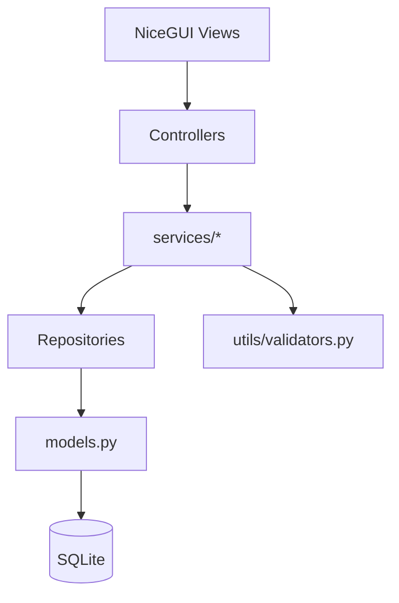

# Technical Design - Betterbank Banking App

## 1. Requirements Elicitation & Clarification

### 1.1 Funktionale Anforderungen (konsolidiert aus README + Requirements)

1. Login mit contract_number und Passwort.
2. Keine Selbstregistrierung, nur vordefinierte User.
3. Transaktionen manuell erfassen (income/expense), bearbeiten, loeschen, filtern.
4. Exactly-one-Regel fuer Belastungsquelle bei Transaktionen: account_id oder card_id oder creditcard_id.
5. Dashboard mit Gesamtbilanz, Summen fuer Zeitraum und Chartdaten.
6. Budget pro Monat/Jahr (optional pro Kategorie) setzen und Ueberschreitung melden.
7. Wiederkehrende Zahlungen speichern (monthly/yearly) und beim Login automatisch ausfuehren, falls faellig.
8. Konten oeffnen/schliessen; Schliessen nur bei balance = 0.
9. Debitkarten bestellen/sperren/ersetzen (nur fuer Privatkonten).
10. Unabhaengige Kreditkarten bestellen/sperren/ersetzen; limit darf nicht ueberschritten werden.
11. Inlandzahlungen per target_iban und purpose.
12. Umbuchungen zwischen eigenen Konten.
13. Kontoauszuege als PDF fuer frei waehlbaren Zeitraum.
14. Feste Kategorienliste wird beim Datenbank-Start angelegt.
15. Beim Erststart werden mindestens 2 Testuser mit je einem Privat- und Sparkonto angelegt.

### 1.2 Nicht-funktionale Anforderungen

1. Architektur soll einfach, klar und fuer Lernzwecke verstaendlich sein.
2. Technologie: Python 3.x, NiceGUI, SQLite, ORM.
3. Architekturprinzip: MVC plus Service-Schicht fuer Business-Logik.
4. Keine Business-Logik in Views/UI.
5. Passwortregeln: mindestens 8 Zeichen, mindestens 1 Sonderzeichen, gehasht gespeichert.
6. Keine externen APIs, kein externer Scheduler.
7. Kein Soft Delete.
8. Kein async/await ausser wo NiceGUI es zwingend braucht.
9. Keine abstrakten Basisklassen.

### 1.3 Annahmen und Klaerungen

1. Kategoriezuordnung wird fachlich fuer Transaktionen benoetigt; die konkrete Persistenz folgt dem Klassendiagramm/Feldvorgaben.
2. Transfer und Payment sind spezialisierte Transaktionen und werden ueber FK auf transactions modelliert.
3. Fellige Dauerauftraege werden synchron im Login-Prozess geprueft und gebucht.
4. Eindeutigkeit von Budget verwendet user_id + month + year + category_id.

## 2. Architecture Reasoning

### 2.1 Gewaehlte Architektur

Es wird eine einfache MVC-Architektur mit Service-Schicht verwendet:

1. Model: ORM-Modelle in models.py
2. View: NiceGUI-Views in views/
3. Controller: Request/Event-Koordination in controllers/
4. Service-Schicht: zentrale Geschaeftslogik als API fuer UI und Controller

Diese Architektur ermoeglicht eine klare Trennung der Verantwortlichkeiten und erleichtert spaetere Erweiterungen.

### 2.2 Warum diese Architektur zu den Anforderungen passt

1. Business-Regeln (Budget, Kreditkartenlimit, Kontoschliessung, Login-Policy) sind zentral und testbar in Services.
2. Views bleiben schlank und enthalten nur Darstellung + Event-Ausloesung.
3. Repositories kapseln DB-Zugriffe und halten Controller/Services sauber.
4. NiceGUI Agent kann direkt gegen stabile Schnittstellen in services/* arbeiten.

### 2.3 Kurzvergleich mit Alternativen

1. Reines MVC ohne Service-Layer: weniger Dateien, aber Logik verteilt sich in Controllern/Views.
2. Vollstaendige Clean Architecture: sehr sauber, aber fuer Lernprojekt zu komplex.

### 2.4 Trade-offs

1. Vorteil: Hohe Wartbarkeit, gute Testbarkeit, klare Aufgaben je Agent.
2. Nachteil: Mehr Strukturdateien als bei einem Mini-Monolithen.

## 3. Architecture Specification

### 3.1 Zielstruktur (Normativ)

betterbank/
├── .github/                 # GitHub-Workflows
├── docs/                    # Projektdokumentation
├── tests/                   # Pytest-Dateien zur Qualitätssicherung
├── pyproject.toml           # Projekt-Konfiguration
├── requirements.txt         # Verwendete Bibliotheken
├── README.md                # Zentrale Projektdokumentation
│
└── src/                     # Der gesamte Quellcode der Anwendung
    ├── __init__.py
    ├── __main__.py          # STARTPUNKT: Initialisiert NiceGUI (ui.run())
    │
    ├── utils/               # HILFSFUNKTIONEN
    │   ├── __init__.py
    │   └── validators.py    # IBAN-, Passwort-, Datums- und Feldvalidierung
    │
    ├── domain/              # DOMÄNENSCHICHT: Business-Objekte (Models)
    │   ├── __init__.py
    │   └── models.py        # Alle SQLModel-Klassen (User, Account, Transaction, etc.)
    │
    ├── data_access/         # PERSISTENZSCHICHT: Datenbank & Repositories
    │   ├── __init__.py
    │   ├── db.py            # SQLite Engine & Session-Setup, Tabellenerstellung
    │   ├── seed.py          # <--- HIER: Skript für Testdaten (Demo-User, Kategorien)
    │   └── repositories/    # Reine CRUD/Query-Operationen pro Domäne
    │       ├── __init__.py
    │       ├── user_repository.py
    │       ├── transaction_repository.py
    │       ├── budget_repository.py
    │       ├── account_repository.py
    │       ├── card_repository.py
    │       ├── recurring_repository.py
    │       └── payment_repository.py
    │
    ├── services/            # ANWENDUNGSLOGIK: Die Service-Schicht (Business-Regeln)
    │   ├── __init__.py      # Fungiert als zentrale API-Fassade nach außen
    │   ├── auth_service.py
    │   ├── transaction_service.py
    │   ├── budget_service.py
    │   ├── account_service.py
    │   ├── card_service.py
    │   ├── recurring_service.py
    │   └── payment_service.py
    │
    └── ui/                  # PRÄSENTATIONSSCHICHT: Der Thin Client im Browser
        ├── __init__.py
        ├── controllers/     # Use-Case-Orchestrierung je Feature-Bereich
        │   ├── __init__.py
        │   ├── auth_controller.py
        │   ├── transaction_controller.py
        │   ├── budget_controller.py
        │   ├── account_controller.py
        │   ├── card_controller.py
        │   ├── recurring_controller.py
        │   └── payment_controller.py
        │
        └── views/           # NiceGUI-Seiten (Rein visuell, keine Fachlogik!)
            ├── __init__.py
            ├── login_view.py
            ├── dashboard_view.py
            ├── transaction_view.py
            ├── budget_view.py
            ├── account_view.py
            ├── card_view.py
            └── payment_view.py

### 3.2 Abweichungen zur Vorgabe

1. Statt einer zentralen services.py wird ein services/-Ordner mit getrennten Service-Dateien genutzt (fachlich sinnvoller und klarer pro Domane).
2. Sonst keine Abweichung von der vorgegebenen Struktur.

### 3.3 Komponenten und Verantwortungen

1. **`src/__main__.py`**:
   Startpunkt der NiceGUI-App, Routing zu Views, App-Bootstrap.
2. **`src/data_access/db.py` & `src/data_access/seed.py`**:
   SQLite Engine/Session, Tabellenerstellung (`db.py`). Erststart-Seed für Kategorien, 2 Testuser und Konten (`seed.py`).
3. **`src/domain/models.py`**:
   Alle ORM-Modelle gemaess Abschnitt 5.
4. **`src/data_access/repositories/*`**:
   Reine CRUD/Query-Operationen pro Domane.
5. **`src/ui/controllers/*`**:
   Use-Case-Orchestrierung je Feature-Bereich.
6. **`src/services/*`**:
   Getrennte Service-Klassen/Module pro Feature-Bereich als API-Schnittstelle fuer UI/Controller.
7. **`src/ui/views/*`**:
   NiceGUI-Seiten, rein visuelle Darstellung, keine Fachlogik.
8. **`src/utils/validators.py`**:
   IBAN-, Passwort-, Datums- und Feldvalidierung.

### 3.4 High-Level Diagramm

### 3.5 Service-Schnittstellen (Vertrag fuer nicegui agent)

Der nicegui agent importiert aus services/* (nicht aus services.py):

Der nicegui agent (Controller/Views) importiert aus `src/services/*`:

1. **`auth_service.py`**:
   login(contract_number, password), session-bezogene Funktionen.
2. **`transaction_service.py`**:
   create_transaction(payload), edit_transaction(transaction_id, payload), delete_transaction(transaction_id, confirm), filter_transactions(...).
3. **`budget_service.py`**:
   set_budget(payload), check_budget_status(month, year, category_id=None).
4. **`account_service.py`**:
   open_account(payload), close_account(account_id), balance-bezogene Funktionen.
5. **`card_service.py`**:
   order_debit_card(account_id), block_debit_card(card_id), replace_debit_card(card_id), create_credit_card(payload), block_credit_card(creditcard_id), replace_credit_card(creditcard_id).
6. **`recurring_service.py`**:
   create_recurring(payload), process_due_recurring_on_login(user_id, login_date).
7. **`payment_service.py`**:
   create_payment(payload), create_transfer(payload), generate_statement(account_id, start_date, end_date).
8. **`dashboard_service.py`**:
   dashboard(start_date, end_date), Aggregationen fuer Gesamtbilanz/Summen/ChartData.

## 4. Software Design Reasoning

### 4.1 Warum diese Struktur

1. Repositories isolieren DB-Details von Fachlogik.
2. Controller bleiben klein und delegieren in Services.
3. Services kapseln alle Business-Regeln zentral.
4. Modelle bilden die fachlichen Entitaeten direkt aus den Anforderungen ab.
5. Trennung von UI und Business Logic verhindert doppelte Logik und erhoeht Wartbarkeit.

### 4.2 Wichtige Business-Regeln (zwingend)

1. Kontoschliessung nur wenn balance == 0.
2. Kreditkarte: balance darf limit nicht ueberschreiten.
3. Passwort gehasht, min. 8 Zeichen, min. 1 Sonderzeichen.
4. Login nur fuer vordefinierte User.
5. Budget eindeutig pro user_id + month + year + category_id.
6. Fellige Dauerauftraege werden beim Login automatisch gebucht.
7. Kein Soft Delete: delete entfernt Daten final.
8. Keine externe Scheduler- oder API-Abhaengigkeit.
9. Nach jedem Delete oder Edit einer Transaktion muessen alle betroffenen Bereiche sofort neu berechnet werden:
   Kontostand (balance) des betroffenen Kontos, Budgetstatus (isexceeded) der betroffenen Kategorie, Dashboard-Werte (Gesamtbilanz, Summen, ChartData) sowie wiederkehrende Zahlungen falls betroffen. Der finance logic agent ist verantwortlich, dass nach jedem create/edit/delete alles konsistent bleibt.

### 4.3 SQLite-Vererbungsstrategie fuer is_a

Transfer und Payment sind is_a Transaction, aber ohne Python-Vererbung:

1. Tabelle transactions speichert gemeinsame Felder.
2. Tabelle transfers speichert transfer-spezifische Felder plus FK auf transaction_id.
3. Tabelle payments speichert payment-spezifische Felder plus FK auf transaction_id.
4. RecurringTransaction ist ebenfalls is_a Transaction: Tabelle recurring_transactions speichert wiederkehrende-spezifische Felder plus FK auf transaction_id (gleiche Umsetzung wie Transfer und Payment).

Damit bleiben gemeinsame Daten zentral und Spezialisierungen sauber getrennt.

## 5. Software Design Specification

### 5.1 Datenmodelle (ORM) - Feldnamen strikt

Hinweis: Es duerfen keine zusaetzlichen Feldnamen eingefuehrt werden, ausser dort, wo durch Fachregel explizit gefordert.

#### User

Felder:
1. user_id (PK)
2. first_name
3. last_name
4. password_hash
5. contract_number

Methode:
1. login(password) -> bool

#### Account

Felder:
1. account_id (PK)
2. account_type (z. B. 'privat' oder 'spar')
3. balance
4. status
5. iban
6. user_id (FK)

Methoden:
1. open()
2. close()

#### DebitCard

Felder:
1. card_id (PK)
2. card_number
3. expire_date
4. status
5. account_id (FK)

Methoden:
1. block()
2. replace()

#### CreditCard

Felder:
1. creditcard_id (PK)
2. card_number
3. expire_date
4. limit
5. balance
6. status
7. user_id (FK)

Methoden:
1. create()
2. block()
3. replace()

#### Transaction (Basistabelle)

Felder:
1. transaction_id (PK)
2. amount
3. date
4. type (income/expense)
5. note
6. category_id (FK -> category.category_id)
7. account_id (FK, nullable)
8. card_id (FK, nullable)
9. creditcard_id (FK, nullable)

Methoden:
1. create()
2. edit()
3. filter()
4. delete()

#### Transfer (eigene Tabelle, is_a Transaction)

Felder:
1. transfer_id (PK)
2. from_account_id
3. to_account_id
4. status
5. transaction_id (FK -> transactions.transaction_id)

#### Payment (eigene Tabelle, is_a Transaction)

Felder:
1. payment_id (PK)
2. target_iban
3. purpose
4. status
5. transaction_id (FK -> transactions.transaction_id)

#### Category

Felder:
1. category_id (PK)
2. name

Feste Kategorien beim DB-Start:
1. Transport
2. Einkaeufe
3. Versicherungen
4. Miete
5. Steuern
6. Freizeit
7. Sparen
8. Well-being
9. Kontouebertrag
10. Sonstiges

#### Budget

Felder:
1. budget_id (PK)
2. user_id (FK; fachlich zwingend fuer Eindeutigkeitsregel)
3. limit_amount (float) - maximales Budget fuer den Zeitraum
4. month
5. year
6. category_id (FK, optional; null => globales Monatsbudget)

Regel:
1. Unique(user_id, month, year, category_id)

Methode:
1. isexceeded() -> boolean

#### RecurringTransaction

Felder:
1. recurring_id (PK)
2. amount (float)
3. target_iban
4. interval (monthly/yearly)
5. start_date
6. end_date (optional)
7. last_executed (date) - wird beim Login geprueft, ob eine Buchung faellig ist
8. account_id (FK) - Quelle der Abbuchung
9. category_id (FK)
10. transaction_id (FK -> transactions.transaction_id)

#### Dashboard

Methode:
1. dashboard()

#### ChartData (kein ORM, dataclass)

Felder:
1. label: str
2. income: float
3. expenses: float

### 5.2 Repository-Verantwortung

1. user_repository.py:
   User laden nach contract_number, Passwort-Hash vergleichen, Testuser anlegen.
2. transaction_repository.py:
   transactions CRUD, Filter nach Zeitraum/Typ.
3. budget_repository.py:
   Budget upsert, isexceeded-Datenbasis, unique-Regel absichern.
4. account_repository.py:
   Konto finden, saldo pruefen, open/close persistieren.
5. card_repository.py:
   DebitCard/CreditCard status aendern, limit-/balance-Updates.
6. recurring_repository.py:
   Faellige Dauerauftraege ermitteln, last_executed aktualisieren.
7. payment_repository.py:
   Payment/Transfer inklusive transaction-Basiseintrag speichern.

### 5.3 Controller-Zustaendigkeit

1. auth_controller.py:
   Login-Prozess inkl. process_due_recurring_on_login.
2. transaction_controller.py:
   create/edit/filter/delete fuer Transaktionen.
3. budget_controller.py:
   Budget setzen und Status berechnen.
4. account_controller.py:
   Kontoeroeffnen/-schliessen.
5. card_controller.py:
   Kartenbestellung, Sperrung, Ersatz.
6. recurring_controller.py:
   Dauerauftraege anlegen und verwalten.
7. payment_controller.py:
   Inlandzahlung, Umbuchung, Auszugserzeugung.

### 5.4 Validierung (utils/validators.py)

1. validate_password_rules(password)
2. hash_password(password)
3. validate_iban(target_iban)
4. validate_transaction_type(type)
5. validate_positive_amount(amount)
6. validate_budget_month_year(month, year)
7. validate_recurring_interval(interval)

### 5.5 Erststart-Seed (seed.py)

Beim ersten Start der Datenbank:

1. Kategorien 1-10 anlegen, falls nicht vorhanden.
2. Der database agent legt mindestens 2 Testuser an.
3. Fuer jeden Testuser genau ein Privatkonto und ein Sparkonto anlegen.
4. Die konkreten Testuser-Namen und Passwoerter werden erst beim Bau von seed.py definiert.

## 6. Assumptions, Open Questions, and Next Steps

### 6.1 Annahmen

1. Alle Folge-Agents verwenden diese Datei als verbindliche Spezifikation.
2. ORM kann mit den vorgegebenen Feldnamen direkt umgesetzt werden.
3. Session-/Token-Details koennen im Controller/Service geregelt werden, ohne neue Pflichtfelder einzufuehren.
4. Kontoauszug wird on-demand erzeugt. Kein Dateipfad wird in der Datenbank gespeichert.

### 6.2 Offene Fragen

Keine.

### 6.3 Naechste Schritte je Agent

1. finance logic agent:
   Implementiert models/services/controller-Logik strikt nach Abschnitt 5 und 3.5.
2. database agent:
   Erstellt ORM-Tabellen inklusive transactions/transfers/payments-FK-Strategie, Unique-Regeln und Seed.
3. nicegui agent:
   Baut main.py und views/* gegen services/*; keine Fachlogik in Views.
4. test agent:
   Erstellt Unit- und Integrationstests fuer Business-Regeln, Repositories und Controller-Flows.
