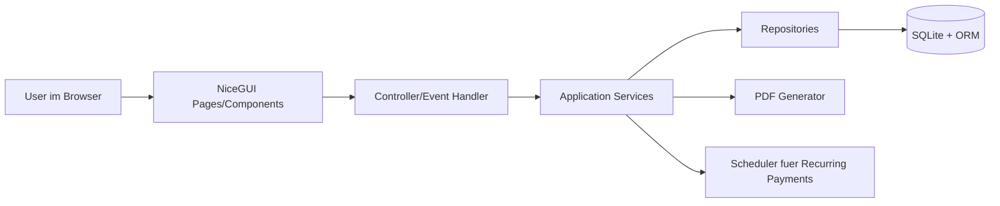
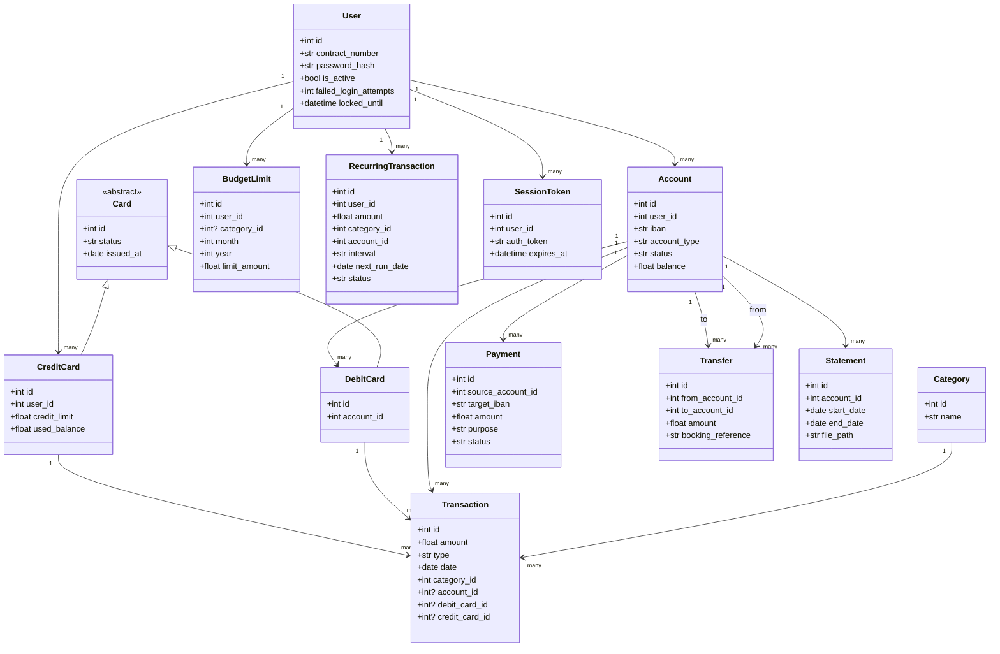

# Technical Design - Betterbank

## 1. Systemuebersicht

Betterbank ist eine serverseitige Webanwendung (NiceGUI als Thin Client im Browser) zur Verwaltung privater Finanzen und typischer Banking-Prozesse. Die Architektur folgt einer klaren Trennung in:

- Presentation Layer (UI-Seiten und Komponenten)
- Application Layer (Services, Use-Case-orientierte Geschaeftslogik)
- Domain/Persistence Layer (ORM-Modelle, Repositories, DB)

Zentrale Leitlinien:

- Business-Regeln sind in Services gekapselt, nicht in der UI.
- ORM-Modelle repraesentieren den fachlichen Kern (Transaktionen, Konten, Karten, Budgets, Zahlungen).
- Validierung erfolgt mehrstufig: UI-Validierung + Service-Validierung + DB-Constraints.
- Sicherheitsrelevante Logik (Auth, Rate-Limits, Sperrungen) ist zentral in AuthService implementiert.

---

## 2. High-Level Architektur

Komponentenverantwortung:

- UI: Dateneingabe, Ergebnisdarstellung, Navigation, Feedback.
- Controller: Mapping von UI-Events auf Service-Aufrufe.
- Services: Fachlogik, Regeln, Orchestrierung mehrerer Modelle.
- Repositories: DB-Zugriffe, Query-Kapselung.
- DB/ORM: Persistenz, Relationen, Konsistenz.

---

## 3. Datenmodelle (Domain + ORM)

### 3.1 Kernmodelle

### User
- Attribute:
  - id: int
  - contract_number: str (unique)
  - password_hash: str
  - full_name: str
  - email: str
  - is_active: bool
  - failed_login_attempts: int
  - locked_until: datetime | null
  - created_at: datetime

### Account
- Attribute:
  - id: int
  - user_id: int (FK -> User)
  - iban: str (unique)
  - account_type: str (private|savings)
  - status: str (active|closed)
  - balance: float
  - created_at: datetime
  - closed_at: datetime | null

### Card (abstrakt)
- Attribute:
  - id: int
  - card_number_masked: str
  - status: str (active|blocked|replaced)
  - issued_at: date
  - blocked_at: date | null

### DebitCard (kontogebunden)
- Attribute:
  - id: int (FK -> Card)
  - account_id: int (FK -> Account)

### CreditCard (unabhaengig)
- Attribute:
  - id: int (FK -> Card)
  - user_id: int (FK -> User)
  - credit_limit: float
  - used_balance: float

### Category
- Attribute:
  - id: int
  - name: str
- Feste Stammdaten:
  - 1 Transport
  - 2 Einkaeufe
  - 3 Versicherungen
  - 4 Miete
  - 5 Steuern
  - 6 Freizeit
  - 7 Sparen
  - 8 Well being
  - 9 Kontouebertrag
  - 10 Sonstiges

### Transaction
- Attribute:
  - id: int
  - amount: float
  - type: str (income|expense)
  - date: date
  - category_id: int (FK -> Category)
  - note: str | null
  - account_id: int | null (FK -> Account)
  - debit_card_id: int | null (FK -> DebitCard)
  - credit_card_id: int | null (FK -> CreditCard)
  - created_at: datetime
  - updated_at: datetime
- Fachregel:
  - Exactly-One-Constraint fuer Belastungsobjekt:
    - Genau eines der Felder account_id, debit_card_id, credit_card_id muss gesetzt sein.

### BudgetLimit
- Attribute:
  - id: int
  - user_id: int (FK -> User)
  - category_id: int | null (FK -> Category)
  - month: int
  - year: int
  - limit_amount: float
  - created_at: datetime
  - updated_at: datetime

### BudgetAlert
- Attribute:
  - id: int
  - budget_limit_id: int (FK -> BudgetLimit)
  - triggered_at: datetime
  - spent_amount: float
  - is_exceeded: bool
  - message: str

### RecurringTransaction
- Attribute:
  - id: int
  - user_id: int (FK -> User)
  - amount: float
  - category_id: int (FK -> Category)
  - account_id: int (FK -> Account)
  - interval: str (monthly|yearly)
  - start_date: date
  - next_run_date: date
  - status: str (active|paused|stopped)

### Payment
- Attribute:
  - id: int
  - source_account_id: int (FK -> Account)
  - target_iban: str
  - amount: float
  - purpose: str
  - status: str (pending|success|failed)
  - created_at: datetime

### Transfer
- Attribute:
  - id: int
  - from_account_id: int (FK -> Account)
  - to_account_id: int (FK -> Account)
  - amount: float
  - created_at: datetime
  - booking_reference: str

### Statement
- Attribute:
  - id: int
  - account_id: int (FK -> Account)
  - start_date: date
  - end_date: date
  - file_path: str
  - created_at: datetime

### SessionToken
- Attribute:
  - id: int
  - user_id: int (FK -> User)
  - auth_token: str (unique)
  - expires_at: datetime
  - revoked_at: datetime | null

### 3.2 Beziehungen

- User 1:n Account
- User 1:n CreditCard
- User 1:n BudgetLimit
- User 1:n RecurringTransaction
- User 1:n SessionToken
- Account 1:n DebitCard
- Account 1:n Transaction (wenn account_id genutzt)
- DebitCard 1:n Transaction (wenn debit_card_id genutzt)
- CreditCard 1:n Transaction (wenn credit_card_id genutzt)
- Category 1:n Transaction
- Category 1:n BudgetLimit (optional)
- Account 1:n Payment (als source_account)
- Account 1:n Statement
- Account 1:n Transfer (als from_account)
- Account 1:n Transfer (als to_account)

---

## 4. Geschaeftslogik-Klassen (Services)

### AuthService
Verantwortung: Login, Session-Management, Credential-Sicherheit, Schutzmechanismen.

Zentrale Methoden:

- login(contract_number: str, password: str) -> AuthResult
- validate_password_policy(password: str) -> bool
- record_failed_login(user_id: int) -> None
- is_user_locked(user_id: int) -> bool
- create_session(user_id: int) -> str
- logout(auth_token: str) -> None

### TransactionService
Verantwortung: CRUD fuer Transaktionen, Validierungen, Filter.

Zentrale Methoden:

- create_transaction(cmd: CreateTransactionCommand) -> Transaction
- update_transaction(transaction_id: int, values: dict) -> Transaction
- delete_transaction(transaction_id: int, confirm: bool) -> bool
- filter_transactions(user_id: int, start_date: date | null, end_date: date | null, category_id: int | null) -> list[Transaction]
- validate_exactly_one_source(account_id, debit_card_id, credit_card_id) -> None

### DashboardService
Verantwortung: Aggregationen fuer Dashboard und Charts.

Zentrale Methoden:

- get_dashboard_summary(user_id: int, start_date: date, end_date: date) -> DashboardSummary
- compute_total_balance(user_id: int) -> float
- build_chart_data(user_id: int, start_date: date, end_date: date) -> list[ChartData]

### BudgetService
Verantwortung: Budgetlimits, Verbrauchsberechnung, Warnungen.

Zentrale Methoden:

- set_budget_limit(user_id: int, month: int, year: int, limit_amount: float, category_id: int | null) -> BudgetLimit
- get_budget_status(user_id: int, month: int, year: int, category_id: int | null) -> BudgetStatus
- evaluate_budget_after_transaction(transaction_id: int) -> BudgetAlert | null
- list_active_alerts(user_id: int) -> list[BudgetAlert]

### RecurringPaymentService
Verantwortung: Verwaltung und Ausfuehrung wiederkehrender Zahlungen.

Zentrale Methoden:

- create_recurring_transaction(cmd: CreateRecurringTransactionCommand) -> RecurringTransaction
- run_due_recurring_transactions(run_date: date) -> int
- pause_recurring_transaction(recurring_id: int) -> bool
- compute_next_run_date(recurring: RecurringTransaction) -> date

### AccountService
Verantwortung: Kontoeroeffnung/-schliessung und Kontoregeln.

Zentrale Methoden:

- open_account(user_id: int, account_type: str) -> Account
- close_account(account_id: int) -> bool
- get_accounts(user_id: int) -> list[Account]
- assert_close_allowed(account_id: int) -> None  # balance == 0

### CardService
Verantwortung: Debitkarten und unabhaengige Kreditkarten verwalten.

Zentrale Methoden:

- order_debit_card(account_id: int) -> DebitCard
- block_debit_card(card_id: int) -> bool
- replace_debit_card(card_id: int) -> DebitCard
- order_credit_card(user_id: int, desired_limit: float) -> CreditCard
- block_credit_card(card_id: int) -> bool
- replace_credit_card(card_id: int) -> CreditCard
- authorize_credit_card_expense(card_id: int, amount: float) -> bool

### PaymentService
Verantwortung: Inlandszahlungen und Kontenumbuchungen.

Zentrale Methoden:

- create_domestic_payment(source_account_id: int, target_iban: str, amount: float, purpose: str) -> Payment
- transfer_between_own_accounts(from_account_id: int, to_account_id: int, amount: float) -> Transfer
- validate_iban(iban: str) -> bool
- assert_sufficient_funds(account_id: int, amount: float) -> None

### StatementService
Verantwortung: Kontoauszugserstellung als PDF.

Zentrale Methoden:

- generate_statement(account_id: int, start_date: date, end_date: date) -> Statement
- load_statement(statement_id: int) -> bytes

---

## 5. UI-Komponenten (NiceGUI)

### LoginView
- Eingaben: contract_number, password
- Aktionen: login
- Ausgabe: Login-Fehler, Redirect zu Dashboard

### DashboardView
- Anzeige: total_balance, total_income, total_expenses
- Diagramme: Balkendiagramm (Einnahmen/Ausgaben)
- Filter: start_date, end_date

### TransactionsView
- Formular: neue Transaktion (inkl. Exactly-One-Source)
- Tabelle: Liste, Filter (Datum/Kategorie)
- Aktionen: edit, delete (mit Bestaetigung)

### BudgetView
- Formular: monatliche Limits (optional je Kategorie)
- Anzeige: Budgetverbrauch, Warnungen bei >= Limit
- Tabelle: aktive Budgets

### RecurringPaymentsView
- Formular: wiederkehrende Zahlung
- Liste: aktive/pausierte Dauerauftraege
- Aktionen: pausieren/reaktivieren

### AccountsCardsView
- Konten: eroeffnen/schliessen (nur bei balance == 0)
- Karten: bestellen/sperren/ersetzen
- Kreditkarten: Limit und verfuegbares Limit anzeigen

### PaymentsView
- Inlandszahlung: target_iban, amount, source_account, purpose
- Umbuchung: from_account, to_account, amount

### StatementsView
- Eingabe: account_id, start_date, end_date
- Ausgabe: PDF-Vorschau/Download

---

## 6. Datenflussbeispiel: "Wie wird eine Transaktion gespeichert?"

1. User erfasst in TransactionsView Betrag, Typ, Datum, Kategorie und genau eine Belastungsquelle.
2. Controller erstellt CreateTransactionCommand und ruft TransactionService.create_transaction auf.
3. TransactionService validiert:
   - amount > 0
   - gueltiges Datum
   - gueltige category_id
   - Exactly-One-Constraint fuer account_id/debit_card_id/credit_card_id
4. Wenn credit_card_id gesetzt ist:
   - CardService.authorize_credit_card_expense prueft verfuegbares Limit
   - bei Erfolg wird used_balance aktualisiert
5. Repository persistiert Transaction atomar in der DB.
6. Nach erfolgreichem Save:
   - BudgetService.evaluate_budget_after_transaction wird ausgelost
   - DashboardService-Aggregate werden invalidiert/neu berechnet
7. UI zeigt Erfolgsmeldung und aktualisierte Liste/Summen.

---

## 7. UML Klassendiagramm (Mermaid)

---

## 8. Nicht-funktionale Architekturentscheidungen

- Konsistenz: Kritische Buchungen (Zahlungen, Umbuchungen, Kreditkartenbelastungen) laufen in DB-Transaktionen.
- Sicherheit: Passwort-Hashing, Session-Token mit Ablauf, Account-Lock bei wiederholten Fehlversuchen.
- Nachvollziehbarkeit: Fachlich wichtige Aktionen (Sperrung, Ersatzkarte, Schliessung) werden auditierbar geloggt.
- Erweiterbarkeit: Services sind fachlich getrennt und koennen spaeter durch APIs oder Background Jobs erweitert werden.
