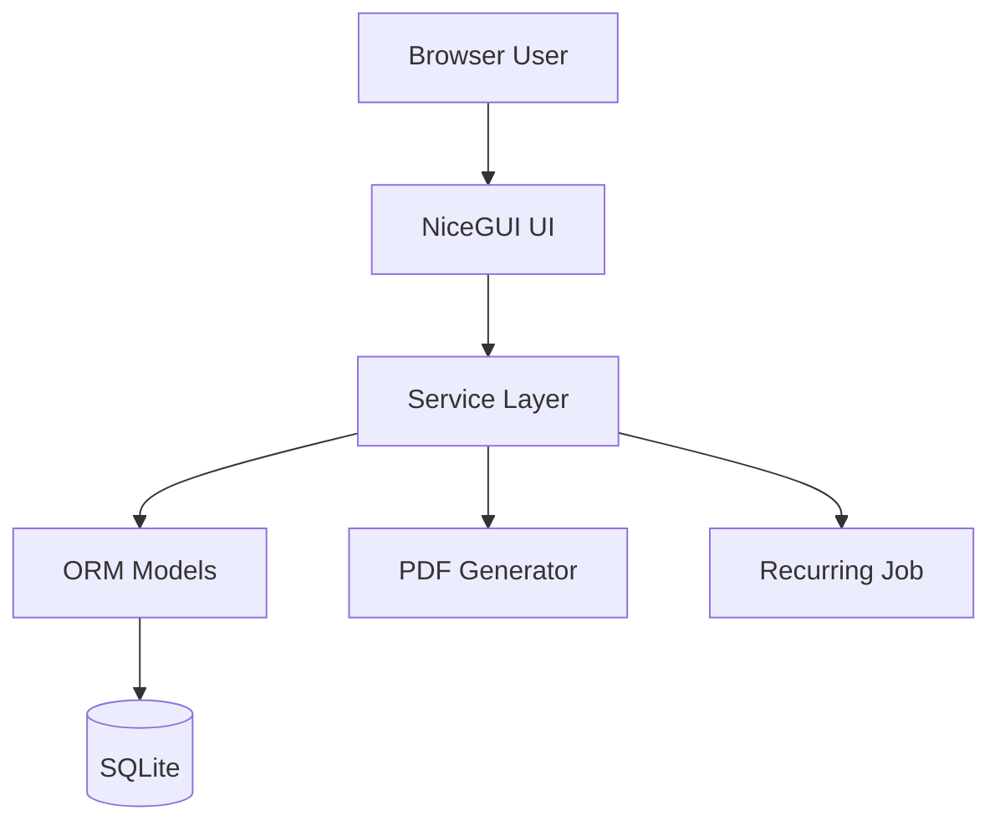
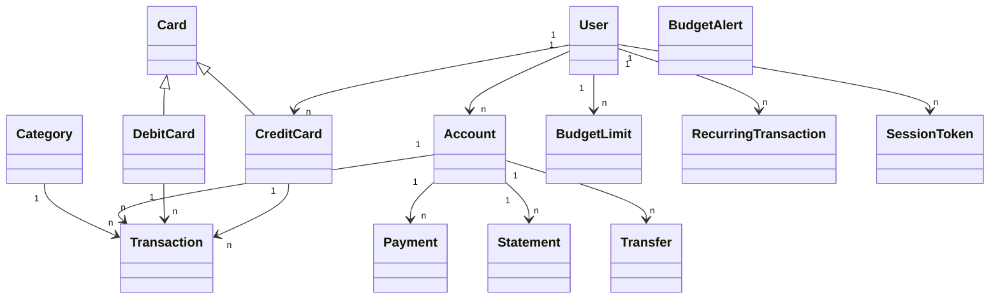

# Technical Design - Betterbank (Lernprojekt)

## 1. Requirements Elicitation & Clarification

### Funktionale Anforderungen

1. Login mit Vertragsnummer und Passwort.
2. Manuelle Erfassung von Einnahmen und Ausgaben.
3. Bearbeiten und Loeschen von Transaktionen.
4. Filter fuer Transaktionen nach Datum und Kategorie.
5. Dashboard mit Gesamtbilanz sowie Einnahmen/Ausgaben fuer Zeitraeume.
6. Monatliche Budgetlimits (optional pro Kategorie) mit Warnung bei Erreichen/Ueberschreitung.
7. Wiederkehrende Zahlungen (monatlich, jaehrlich).
8. Konteneroeffnung und Kontoschliessung (nur bei Kontostand 0).
9. Debitkarten verwalten (bestellen, sperren, ersetzen), nur fuer Privatkonten.
10. Unabhaengige Kreditkarten verwalten (bestellen, sperren, ersetzen) mit Kreditlimit.
11. Inlandzahlungen per IBAN.
12. Umbuchung zwischen eigenen Konten.
13. Kontoauszuege als PDF fuer freie Zeitraeume.
14. Feste Kategorienliste (1-10), keine freien Kategorien im MVP.

### Nicht-funktionale Anforderungen

1. Einfache, gut verstaendliche Architektur fuer Lernzwecke.
2. Browser-App mit NiceGUI als Thin Client.
3. ORM-basierte Datenhaltung mit SQLite.
4. Eingabevalidierung auf UI- und Service-Ebene.
5. Passwoerter nur gehasht speichern.
6. Schutz bei wiederholten Login-Fehlern (temporare Sperre).
7. Keine Selbstregistrierung im MVP.

### Annahmen und Klaerungen

1. Es gibt genau einen Hauptnutzerfluss: Login und danach Nutzung der Funktionen.
2. Waehrung ist EUR.
3. 2FA ist im MVP nicht enthalten.
4. Budgetwarnung erfolgt erst bei Erreichen oder Ueberschreiten des Limits (nicht bei 80%).
5. Kontoauszuege nutzen ein fixes PDF-Layout.

## 2. Architecture Reasoning

### Gewaehlte Architektur

Es wird eine einfache Layered Architecture genutzt:

1. UI Layer (NiceGUI Seiten)
2. Service Layer (Geschaeftslogik)
3. Persistence Layer (ORM + SQLite)

Diese Struktur passt gut zu einem Lernprojekt, weil sie klar trennt, wo was passiert.

### Warum das gut zu den Anforderungen passt

1. Viele Regeln sind fachlich (z. B. Exactly-one-Regel bei Transaktionen, Kontoschliessung nur bei 0). Diese Regeln gehoeren in den Service Layer.
2. Viele Datenobjekte mit Beziehungen (User, Account, Card, Transaction, Budget). Das passt sehr gut zu ORM.
3. NiceGUI ermoeglicht schnelle Umsetzung einer einfachen Browser-App ohne komplexes Frontend-Framework.
4. Diese Architektur ermoeglicht eine klare Trennung der Verantwortlichkeiten und erleichtert spaetere Erweiterungen.

### Moegliche Alternativen (kurz)

1. Monolith ohne Layer: waere schneller startbar, aber unuebersichtlich.
2. Vollstaendiges Clean Architecture Setup: sehr sauber, aber fuer ein Lern-MVP oft zu umfangreich.

### Trade-offs

1. Pro Layered Architecture: leicht verstaendlich, testbar, gut erweiterbar.
2. Contra Layered Architecture: etwas mehr Dateien als bei einer sehr kleinen Ein-Datei-Loesung.

## 3. Architecture Specification

### Gesamtarchitektur

1. UI (NiceGUI): Formulare, Tabellen, Dashboard, Meldungen.
2. Services: validieren Eingaben und setzen Geschaeftsregeln durch.
3. Models/Database: speichern Daten dauerhaft in SQLite.

### Hauptkomponenten und Verantwortung

1. AuthService: Login, Passwortregeln, Sperrlogik, Session-Token.
2. TransactionService: anlegen, aendern, loeschen, filtern, Exactly-one-Regel.
3. DashboardService: Bilanz- und Summenberechnung, Chartdaten.
4. BudgetService: Limits setzen, Verbrauch pruefen, Warnungen erzeugen.
5. RecurringPaymentService: wiederkehrende Zahlungen planen und ausfuehren.
6. AccountService: Konten oeffnen/schliessen und Status verwalten.
7. CardService: Debit-/Kreditkarten bestellen, sperren, ersetzen.
8. PaymentService: Inlandszahlungen und Umbuchungen.
9. StatementService: PDF-Auszuege generieren.

### High-Level Diagramm

## 4. Software Design Reasoning

### Warum diese Klassen

1. Klassen orientieren sich direkt an den fachlichen Begriffen aus den Anforderungen.
2. Das macht den Code fuer Lernzwecke leichter nachvollziehbar.
3. Jede Klasse hat eine klare Rolle (Single Responsibility auf einfacher Ebene).

### Wichtige Designregeln

1. Exactly-one-Regel bei Transaktionen:
   Genau eine Quelle muss gesetzt sein: account_id oder debit_card_id oder credit_card_id.
2. Datenintegritaet:
   Positiver Betrag, gueltige Statuswerte, gueltige Intervalle.
3. Sicherheitsregeln:
   Passwort nie im Klartext, Login-Sperre bei zu vielen Fehlversuchen.
4. Fachregeln:
   Konto schliessen nur bei Kontostand 0, Debitkarte nur fuer Privatkonto.
5. Kreditkartenregel:
   Ausgabe nur wenn amount kleiner/gleich verfuegbares Limit.
6. Trennung von UI und Business Logic verhindert doppelte Logik und erhoeht Wartbarkeit.

## 5. Software Design Specification

### Datenmodelle (einfach)

| Modell | Wichtige Attribute | Zweck |
|---|---|---|
| User | id, contract_number, password_hash, locked_until | Benutzer und Login |
| Account | id, user_id, iban, account_type, status, balance | Giro-/Sparkonto |
| Card | id, status, issued_at, card_type | Basiskarte |
| DebitCard | id, account_id | Kontogebundene Karte |
| CreditCard | id, user_id, credit_limit, used_balance | Unabhaengige Kreditkarte |
| Category | id, name | Feste Kategorien 1-10 |
| Transaction | id, amount, type, date, category_id, account_id/debit_card_id/credit_card_id | Einnahme/Ausgabe |
| BudgetLimit | id, user_id, category_id, month, year, limit_amount | Monatsbudget |
| BudgetAlert | id, budget_limit_id, spent_amount, is_exceeded | Budgetwarnung |
| RecurringTransaction | id, amount, account_id, target_iban, interval, next_run_date, status | Wiederkehrende Zahlung |
| Payment | id, source_account_id, target_iban, amount, status | Inlandszahlung |
| Transfer | id, from_account_id, to_account_id, amount | Kontenumbuchung |
| Statement | id, account_id, start_date, end_date, file_path | Kontoauszug-PDF |
| SessionToken | id, user_id, auth_token, expires_at | Sessionverwaltung |

### Services (Methodenbeispiele)

| Service | Kernmethoden |
|---|---|
| AuthService | login, create_session, record_failed_login |
| TransactionService | create_transaction, update_transaction, delete_transaction, filter_transactions |
| DashboardService | get_dashboard_summary, compute_total_balance |
| BudgetService | set_budget_limit, evaluate_budget_after_transaction |
| RecurringPaymentService | create_recurring_transaction, run_due_recurring_transactions |
| AccountService | open_account, close_account |
| CardService | order_debit_card, block_card, replace_card, order_credit_card |
| PaymentService | create_domestic_payment, transfer_between_own_accounts |
| StatementService | generate_statement |

### UI-Komponenten (NiceGUI)

1. Login-Seite: Vertragsnummer + Passwort.
2. Dashboard-Seite: Bilanz, Einnahmen/Ausgaben, Balkendiagramm.
3. Transaktions-Seite: Formular, Tabelle, Filter, Bearbeiten/Loeschen.
4. Budget-Seite: Limits und Warnungen.
5. Wiederkehrende Zahlungen-Seite: Serien verwalten.
6. Konten/Karten-Seite: Konto- und Kartenaktionen.
7. Zahlungen-Seite: IBAN-Zahlung und Umbuchung.
8. Auszuege-Seite: PDF-Auszug fuer Zeitraum.

### Einfaches Klassendiagramm

## 6. Assumptions, Open Questions, and Next Steps

### Annahmen

1. Einfache Rollenlage: nur normale Nutzer, kein separates Admin-Backend im MVP.
2. Alle Daten liegen lokal in SQLite.
3. Kategorien sind fix und werden initial geseedet.

### Offene Fragen

1. Wie viele Fehlversuche loesen genau die Login-Sperre aus.
2. Wie lange soll die temporare Sperre dauern.
3. Soll Budget auch global ohne Kategorie gesetzt werden koennen oder nur kategoriespezifisch.
4. Wie lange Session-Token gueltig sind.

### Naechste Schritte

1. Projektstruktur nach Layern anlegen (ui, services, database).
2. ORM-Modelle und DB-Initialisierung implementieren.
3. Basis-Services mit Validierung erstellen.
4. Einfache NiceGUI-Seiten fuer Login, Dashboard und Transaktionen bauen.
5. Danach schrittweise Budget, Karten, Zahlungen und Auszuege ergaenzen.
